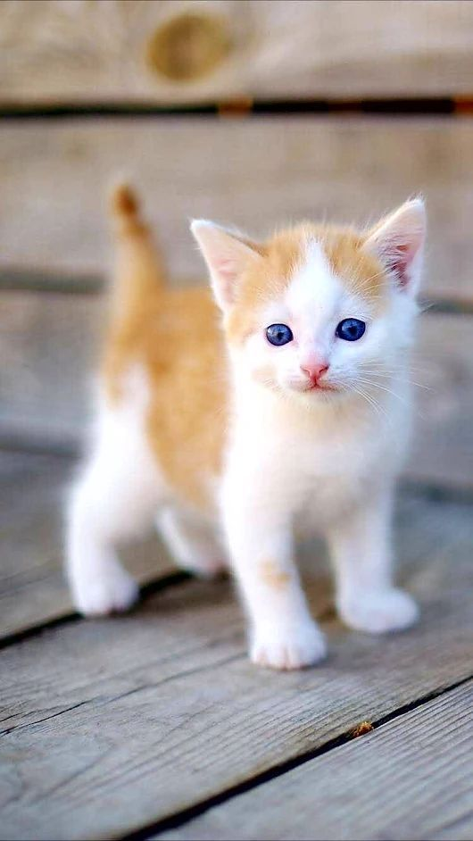
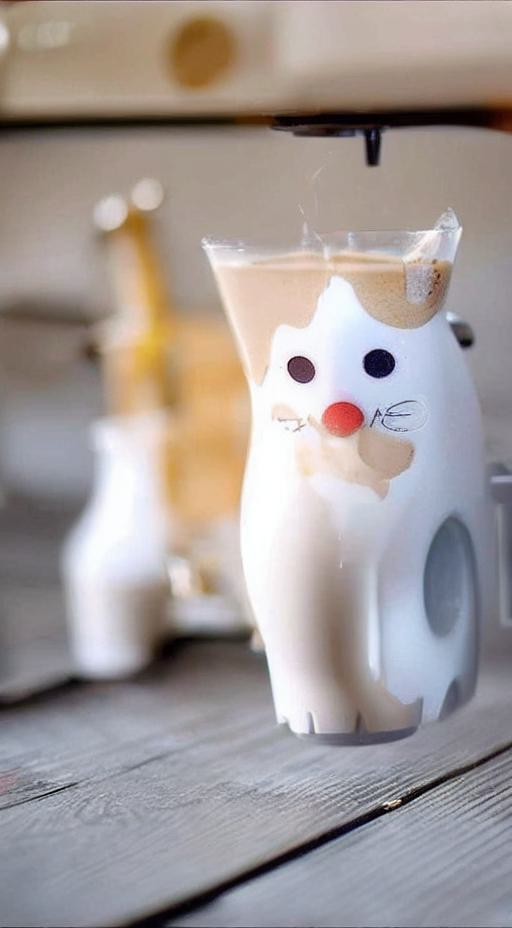

# MagicMix: Semantic Mixing with Diffusion Models


## Examples

<p align="center">
  
  
  
</p>

## Code run
```
cd src
python runner.py 
```
Change/Tune all parameters whether in file ```runner.py``` or through terminal
